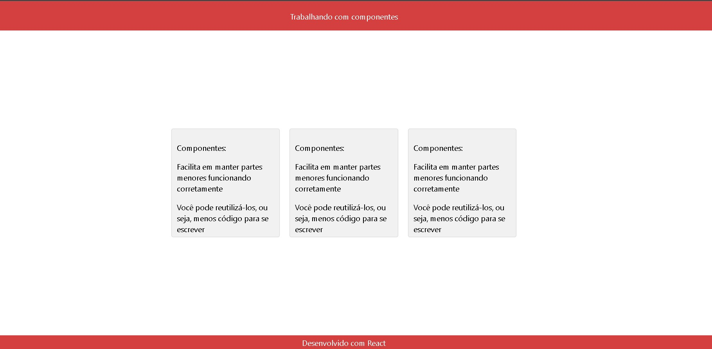

<h1 align="center">
  dev_media
</h1>

<p align="center">
  

  

  <a href="https://github.com/wander27rodrigues/menu_mobile/commits/main">
    
  </a>
  
  
<p align="center">
  <a href="#-Tecnologias">Tecnologias</a>&nbsp;&nbsp;&nbsp;|&nbsp;&nbsp;&nbsp;
  <a href="#-projeto">Projeto</a>&nbsp;&nbsp;&nbsp;|&nbsp;&nbsp;&nbsp;
  <a href="#-layout">Layout</a>&nbsp;&nbsp;&nbsp;|&nbsp;&nbsp;&nbsp;
  <a href="#-Licença">Licença</a>
</p>

</p>


> Status do Projeto: ⚠️  (produção)


## 💻 Sobre o projeto
Esse é um projeto que realizei para estudo do react
## ⚙️ Funcionalidades

- [x] Componentes

## 🛠 Tecnologias

As seguintes ferramentas foram usadas na construção do projeto:

-   CSS
-   REACT

## 🔖 Layout
<p align="center">
  
</p>

## Tarefas 

-   [X] Criação de Estrutura
-   [X] Add  layout

### ✔️ Pré-requisitos

Antes de começar, você vai precisar ter instalado em sua máquina as seguintes ferramentas:
[Git](https://git-scm.com). 
Além disto é bom ter um editor para trabalhar com o código como [VSCode](https://code.visualstudio.com/)

### :arrow_forward: Rodando 

```bash

# Clone este repositório
$ git clone git@github.com:Wander27Rodrigues/dev_Media.git

# Acesse a pasta do projeto no terminal/cmd
$ cd dev_Media

# Instale as dependências
$ npm install

# Execute a aplicação em modo de desenvolvimento
$ npm run dev:server

```
## 💪 Como contribuir no projeto

1. Faça um **fork** do projeto.
2. Crie uma nova branch com as suas alterações: `git checkout -b my-feature`
3. Salve as alterações e crie uma mensagem de commit contando o que você fez: `git commit -m "feature: My new feature"`
4. Envie as suas alterações: `git push origin my-feature`
> Caso tenha alguma dúvida confira este [guia de como contribuir no GitHub](./CONTRIBUTING.md)

## 📝 Licença

Este projeto esta sobe a licença [MIT](./LICENSE).

### Autor
---

<a href="https://wander27rodrigues.github.io/#home">
 
 <br />

Feito com ❤️ por Wander Souza 👋🏽 Entre em contato!

[](https://www.linkedin.com/in/wander-souza/) 
[](mailto:wanderrodrigues_@outlook.com)
